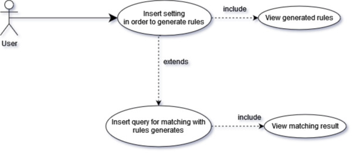

# 🌠 LookBack Apriori Algorithm
This is a flask app developed in order to manage data and through LookBack Apriori Algorithm creates a set of rules to match a user query.


## Project description
The application is based on LAL, this algorithm is an extension with time of classic Apriori Algorithm.
It's a data mining techniques to analyze big datasets.
We simulate that the data (Data/) coming from fitbit.

### 🚀 Future implementation
This project represents the server and in the future it will connected through API with Database and mobile Application.

### 🐍 Technologies used
To develop application i used VisualStudio code and powershell integrated.
The language to handle data and creates algorithm is Python.

I used a Flask because it's a Python module that lets me develop web application easily.

Web App pages are based on Bootstrap a front-end framework used to create modern websites and web apps.
It's open-source and free to use, yet features numerous HTML and CSS templates for UI interface elements.

## ⚠️ Installation and Run the Project
### Configuration
- Clone the project
```
 git clone https://github.com/DataScienceUNIVR/Temporal_Apriori_Algorithm
  ```
- Create a virtual enviroment
- Put the project in venv
- Activate venv:
   
   ```
   .\Scripts\activate
   ```
- Install all library necessary:  
   ```
   pip install -r requirements.txt
    ```

### Run
0- Make sure you have activate venv

1- You need to add enviroment variable.
- Win10 powershell:  ```$FLASK_APP="app"```
- Linux and MacOs: ```export FLASK_APP=app```

2- Launch app.
- ```flask run```

3- Open http://127.0.0.1:5000/

## ⚡ Usage
### Use case diagram

- Settings page: compile form with setting in order to generate rules
### The pages

- Rules generated

- MatchQuery: insert a query for matching

- Result of matching


## Authors

- 🇮🇹 [@MarcoCastelli](https://github.com/MarcoCastelli4)
- [](https://it.linkedin.com/in/marco-castelli-65643b203)

